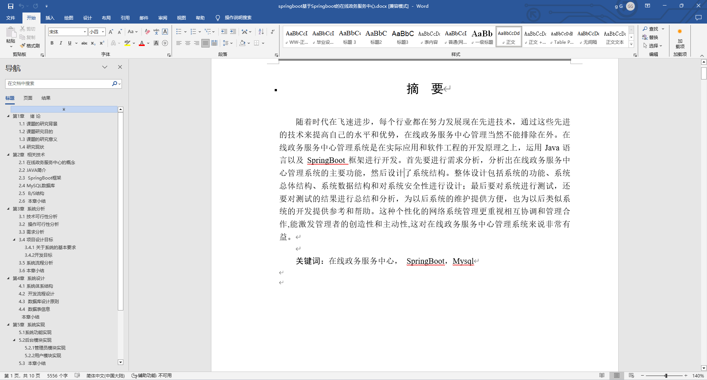
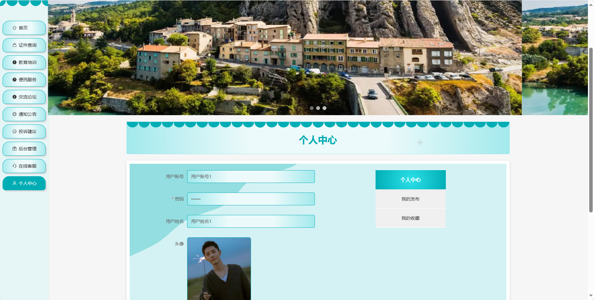
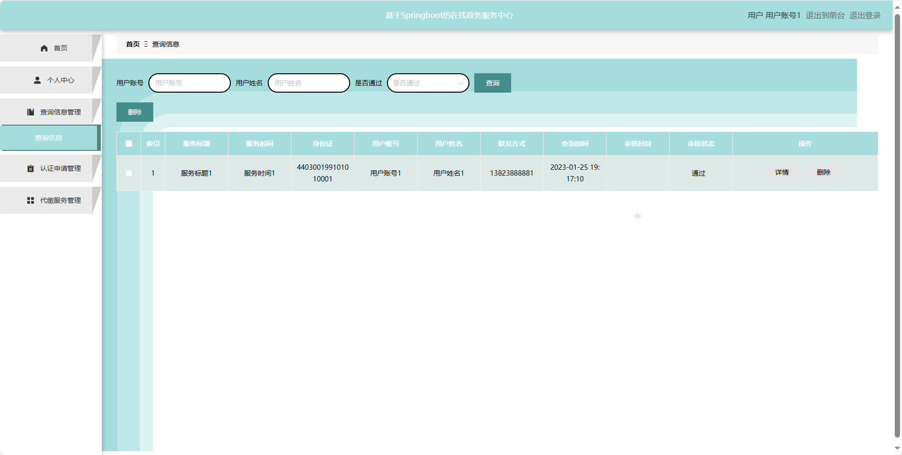
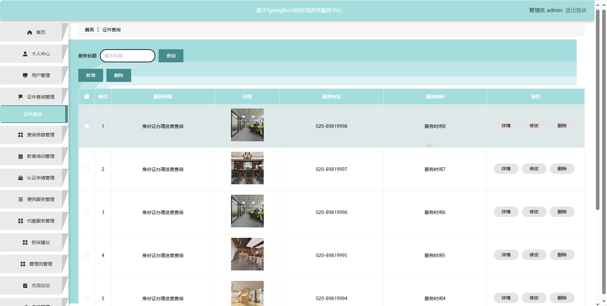
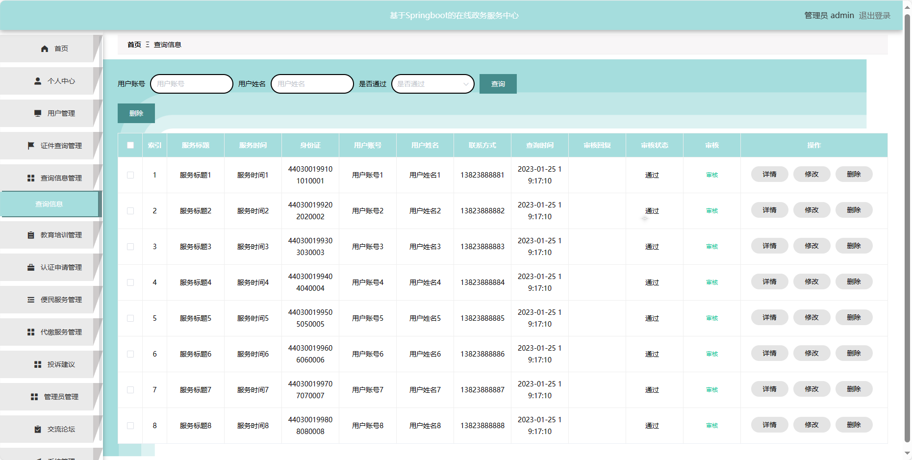

## 基于SpringBoot的在线政务服务中心(程序+报告)

###  获取sql数据库文件: 从戎源码网 (https://armycodes.com/) QQ: 386869957 QQ群: 377586148
###  所有系统地址: (https://github.com/YuLin-Coder/AllProjectCatalog) 
###  所有项目以及源代码本人均调试运行无问题 可支持远程安装部署调试、定制修改、代码讲解

## 项目介绍
基于SpringBoot的在线政务服务中心，系统包含两种角色：管理员、用户,系统主要功能如下。

### 【管理员】:
1. 首页：系统管理的起始页面。
2. 个人中心：管理管理员个人信息。
3. 用户管理：编辑和管理用户信息。
4. 证件查询管理：管理证件查询服务。
5. 查询信息管理：管理用户查询的相关信息。
6. 教育培训管理：编辑和管理教育培训信息。
7. 认证申请管理：处理用户的认证申请。
8. 便民服务管理：编辑和管理便民服务信息。
9. 代缴服务管理：处理用户的代缴服务请求。
10. 在线客服：提供在线客服支持。
11. 投诉建议：查看和处理用户的投诉和建议。
12. 管理员管理：编辑和管理其他管理员信息。
13. 交流论坛：管理论坛相关内容。
14. 系统管理：进行系统的基本设置。

### 【用户】:
1. 首页：展示系统。
2. 证件查询：进行相关证件的查询。
3. 教育培训：浏览教育培训相关信息。
4. 便民服务：获取便民服务相关信息。
5. 交流论坛：参与社区交流和讨论。
6. 通知公告：查看系统发布的通知和公告。
7. 投诉建议：提出对系统或服务的投诉和建议。

## 项目技术
- 编程语言：Java
- 数据库：MySQL
- 项目管理工具：Maven
- 前端技术：HTML、CSS、JavaScript、Jquery、Vue
- 后端技术：Spring、SpringMVC、MyBatis

## 运行环境
- JDK版本：JDK1.8及以上
- 开发工具：IDEA、Ecplise、Myecplise都可以
- 数据库: MySQL5.7及以上
- Maven：maven3.0及以上
- Node：14.14.0及以上

## 运行截图

